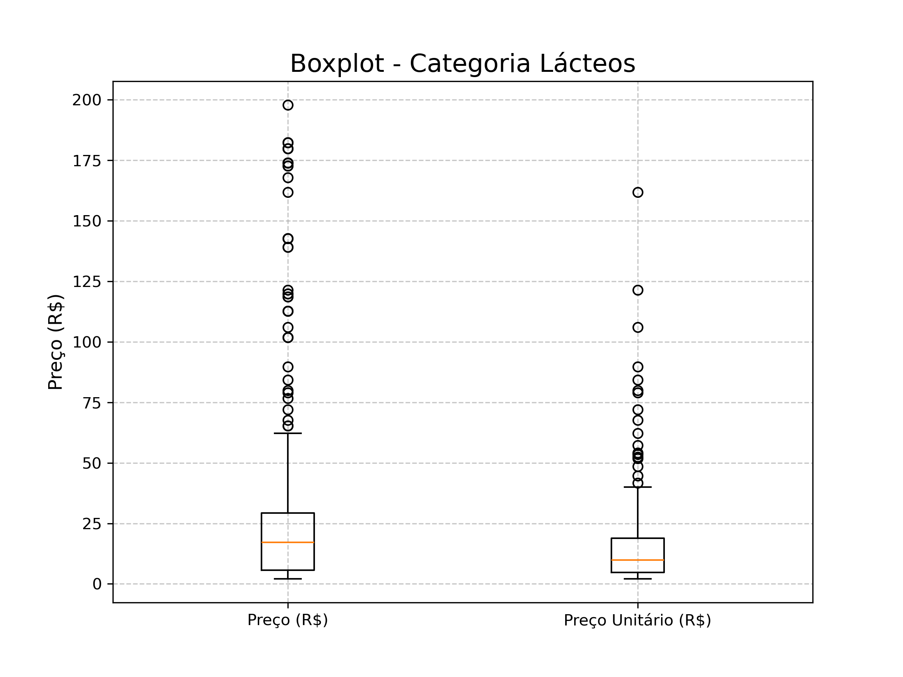
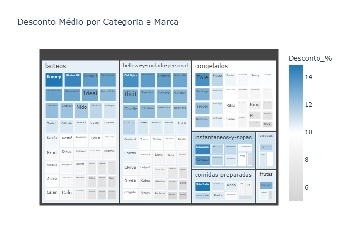

[](https://git.io/typing-svg)


---

## 📑 Summary

- [Objective](#-objective)
- [Technologies](#-technologies-used)
- [Project Structure](#-project-structure)
- [Statistical Analysis](#-statistical-analysis)
- [Chart Examples](#-chart-examples)
- [Possible Insights](#-possible-insights)
- [How to Run](#-how-to-run)
- [Dataset](#-dataset-it-is-recommended-to-use-a-virtual-environment)
- [Author](#-author)

---

# Comparative Analysis — Regular Price vs. Unit Price

This repository contains an exploratory analysis comparing **Regular Price (R$)** and **Unit Price** of supermarket products, with emphasis on variations across categories.  
The analysis was conducted using **Python**, leveraging data manipulation and visualization libraries.

---

## Objective

Evaluate pricing strategies and dispersion, identifying categories with the greatest impact and significant variation, highlighting:

- Products with the highest price fluctuation  
- Impact on specific categories such as **dairy** and **beauty & personal care**  
- Statistical distribution and behavior (mean, median, and standard deviation) by category

---

## Technologies Used

- **Python 3.13**
- **Jupyter Notebook** (recommended for interactive analysis)
- **Development Environments**: PyCharm / VSCode
- **Libraries**:
  - `pandas` — data manipulation
  - `numpy` — numerical operations
  - `matplotlib.pyplot` — static visualizations
  - `seaborn` — statistical plots
  - `plotly.express` — interactive charts and maps

---

## 📁 Project Structure

```
price-analysis-chile/
├── .git/                          # Git version control
├── .ipynb_checkpoints/            # Jupyter auto-saves
├── data/
│   └── raw/                       # Raw dataset (CSV)
├── docs/                          # Documentation and interactive files (e.g., treemap.html)
├── img/                           # Generated chart images
├── notebooks/
│   ├── analise_precos.ipynb       # Main analysis notebook
│   └── Profissao Cientista de Dados_Extraindo_Médias.ipynb  # Legacy notebook for study
├── .gitignore                     # Git ignore rules
├── README.md                      # Project overview and instructions
└── requirements.txt               # Project dependencies
```

---

## 📈 Statistical Analysis

### **General Statistics**
| Metric           | Regular Price (R$) | Unit Price |
|------------------|--------------------|------------|
| Mean             | 28.20              | 21.57      |
| Standard Deviation | 31.35            | 21.57      |
| Count (n)        | 813.000            | 813.000    |

---

### **By Category — Unit Price**
| Category                    | Mean   | Median | Std. Dev. |
|-----------------------------|--------|--------|-----------|
| belleza-y-cuidado-personal | 28.84  | 20.99  | 21.67     |
| comidas-preparadas         | 39.55  | 37.40  | 13.22     |
| congelados                 | 30.21  | 29.54  | 19.04     |
| frutas                     | 17.24  | 11.95  | 16.39     |
| instantaneos-y-sopas       | 11.79  | 6.89   | 12.76     |
| **lacteos**                | **15.13** | **9.89** | **17.82** |
| verduras                   | 14.57  | 12.50  | 9.72      |

---

### **By Category — Regular Price (R$)**
| Category                    | Mean   | Median | Std. Dev. |
|-----------------------------|--------|--------|-----------|
| belleza-y-cuidado-personal | 29.20  | 21.79  | 21.63     |
| comidas-preparadas         | 39.55  | 37.40  | 13.22     |
| congelados                 | 30.21  | 29.54  | 19.04     |
| frutas                     | 17.24  | 11.95  | 16.39     |
| instantaneos-y-sopas       | 11.79  | 6.89   | 12.76     |
| **lacteos**                | **30.29** | **17.20** | **41.99** |
| verduras                   | 14.57  | 12.50  | 9.72      |

---

## Chart Examples

> Below are some visualizations generated from the analysis (all images are stored in the `img/` folder):

### ✅ Price Dispersion — Boxplot Comparison


### ✅ Price Distribution by Category — Interactive Treemap


---

## Possible Insights

- **Dairy products** show the largest difference between Regular and Unit Price.
- The **beauty & personal care** category has a tight median and standard deviation, indicating low dispersion and few outliers.
- Categories like **dairy** have high standard deviation, suggesting strong price variation.
- Unit Price tends to be more stable than Regular Price.

---

## ▶ How to Run

```bash
# Clone the repository
git clone https://github.com/seu-usuario/price-analysis-chile.git

# Navigate to the project folder
cd price-analysis-chile

# (Optional) Create and activate a virtual environment
python -m venv venv
source venv/bin/activate  # Linux/macOS
venv\Scripts\activate     # Windows

# Install dependencies
pip install -r requirements.txt
```

### Running the Analysis

- Open the main notebook:
  ```
  notebooks/analise_precos.ipynb
  ```

- For study and comparison purposes, explore:
  ```
  notebooks/Profissao Cientista de Dados_Extraindo_Médias.ipynb
  ```

---

## 📂 Dataset (It is recommended to use a virtual environment)

The dataset is available in:

```
data/raw/
```

It is ready for analysis. To regenerate the charts, ensure all libraries are installed and run the notebooks via Jupyter.

---

## 👨‍💻 Author

**Johnny Sorato Martins Fernandes**  
Business Consultant | Data & Visualization Specialist | Executive Director at Tutoreanos — Primavera do Leste Unit

---

## 🔖 Tags

`data-science`, `price-analysis`, `product-categories`, `descriptive-statistics`, `boxplot`, `discount-visualization`, `interactive-map`, `python`, `pandas`, `seaborn`, `plotly`

---

Let me know if you'd like a second README focused just on the notebooks or study materials. I can whip that up next!
