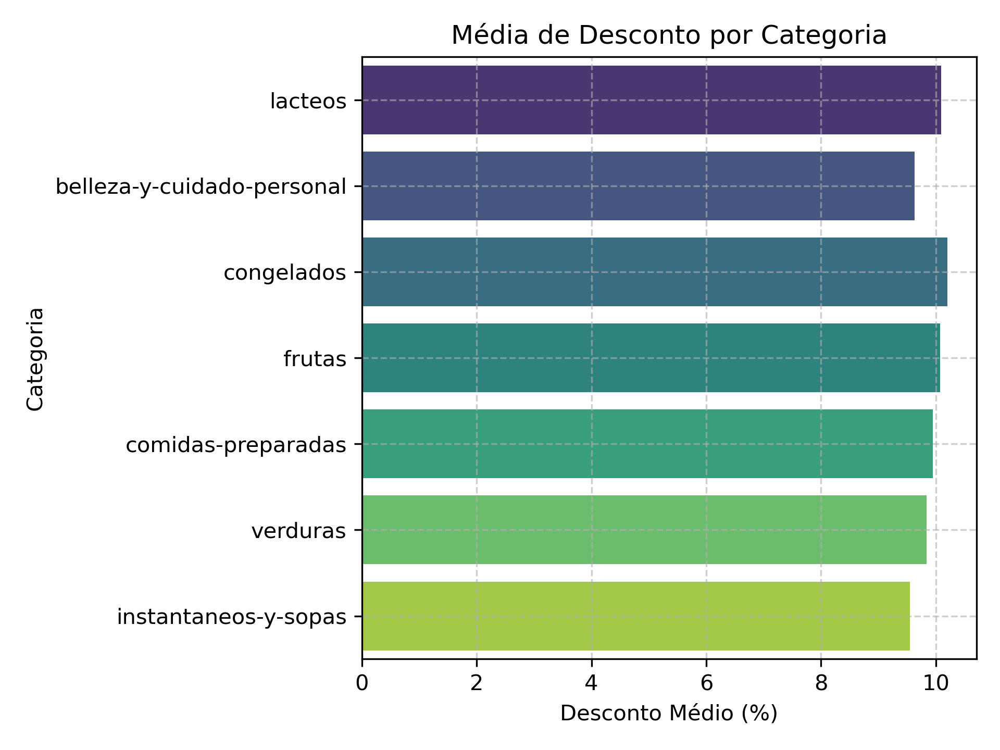

[](https://git.io/typing-svg)


---

## 📑 Sumário

- [Objetivo](#objetivo)
- [Tecnologias](#tecnologias-utilizadas)
- [Estrutura do Projeto](#estrutura-do-projeto)
- [Análise Estatística](#análise-estatística)
- [Exemplos de Gráficos](#exemplos-de-gráficos)
- [Possíveis Insights](#possíveis-insights)
- [Como Executar](#como-executar)
- [Dataset](#dataset-é-recomendado-usar-um-ambiente-virtual)
- [Autor](#autor)

---

# Análise Comparativa — Preço Regular vs. Preço Unitário

Este repositório contém uma análise exploratória comparando **Preço Regular (R$)** e **Preço Unitário** de produtos de supermercado, com ênfase nas variações entre categorias.  
A análise foi realizada utilizando **Python**, com apoio de bibliotecas de manipulação e visualização de dados.

---

## Objetivo

Avaliar estratégias de precificação e dispersão, identificando categorias de maior impacto e variação significativa, destacando:

- Produtos com maior flutuação de preços  
- Impacto em categorias específicas como **lácteos** e **beleza & cuidado pessoal**  
- Distribuição estatística e comportamento (média, mediana e desvio padrão) por categoria  

---

## Tecnologias Utilizadas

- **Python 3.13**
- **Jupyter Notebook** (recomendado para análise interativa)
- **Ambientes de Desenvolvimento**: PyCharm / VSCode
- **Bibliotecas**:
  - `pandas` — manipulação de dados
  - `numpy` — operações numéricas
  - `matplotlib.pyplot` — visualizações estáticas
  - `seaborn` — gráficos estatísticos
  - `plotly.express` — gráficos e mapas interativos

---

## Estrutura do Projeto

```

price-analysis-chile/
├── .git/                          # Metadados de controle de versão Git
├── .ipynb\_checkpoints/            # Checkpoints automáticos do Jupyter
├── data/
│   └── raw/                       # Arquivos brutos do dataset (ex.: CSV)
├── docs/                          # Documentação e assets interativos (ex.: treemap.html)
├── img/                           # Imagens exportadas e visualizações
├── notebooks/
│   ├── price\_analysis.ipynb       # Notebook principal da análise
│   └── data\_scientist\_study.ipynb # Notebook legado para estudo e comparação
├── .gitignore                     # Regras para ignorar arquivos desnecessários
├── README.md                      # Descrição principal do projeto (Inglês)
├── README\_pt.md                   # Descrição do projeto em Português
└── requirements.txt               # Dependências Python do projeto

````

---

## Análise Estatística

### Preços por Categoria — Visão Geral

O **Preço Médio Regular (R$28,20)** é maior que o **Preço Médio Unitário (R$21,57)**, o que indica espaço para promoções e embalagens menores.

A alta dispersão dos preços (alto desvio padrão) sugere heterogeneidade de produtos, com diferentes faixas de valor percebido.

### **Estatísticas Gerais**
| Métrica            | Preço Regular (R$) | Preço Unitário |
|--------------------|--------------------|----------------|
| Média              | 28,20              | 21,57          |
| Desvio Padrão      | 31,35              | 21,57          |
| Contagem (n)       | 813.000            | 813.000        |

---

**Figura 1:** Estatísticas gerais dos preços Regular e Unitário. Nota-se a grande dispersão do Preço Regular, com desvio padrão (31,35) superior à média (28,20), sugerindo forte variedade de produtos e segmentação de preços.

### **Por Categoria — Preço Regular (R$)**

| Categoria                   | Média  | Mediana | Desvio Padrão |
|-----------------------------|--------|---------|---------------|
| beleza-e-cuidado-pessoal    | 29,20  | 21,79   | 21,63         |
| comidas-preparadas          | 39,55  | 37,40   | 13,22         |
| congelados                  | 30,21  | 29,54   | 19,04         |
| frutas                      | 17,24  | 11,95   | 16,39         |
| instantaneos-e-sopas        | 11,79  | 6,89    | 12,76         |
| **lacteos**                 | **30,29** | **17,20** | **41,99** |
| verduras                    | 14,57  | 12,50   | 9,72          |

---

**Figura 2:** Resumo estatístico dos preços regulares por categoria. A diferença notável entre a média (R$30,29) e a mediana (R$17,20) em **lácteos**, combinada com o maior desvio padrão (R$41,99), indica ampla faixa de preços, possivelmente influenciada por itens premium.

### **Comparação entre Média e Mediana (Preço Regular R$)**

| Categoria                   | Preço Médio (R$) | Mediana (R$) | Observação Estratégica                                                                 |
|-----------------------------|------------------|--------------|-----------------------------------------------------------------------------------------|
| **Comidas Preparadas**      | 39,55            | 37,40        | Ticket médio mais alto, mercado **premium**; consumidores dispostos a pagar mais.       |
| **Congelados**              | 30,21            | 29,54        | Valores estáveis, pouco desvio; categoria confiável para margens previsíveis.           |
| **Beleza & Cuidado Pessoal**| 29,20            | 21,79        | Forte dispersão → produtos básicos e premium. Oportunidade de **segmentação de público**. |
| **Lácteos**                 | 30,29            | 17,20        | **Maior desvio-padrão (41,99)** → grande volatilidade; **urgente revisão de portfólio**.|
| **Frutas**                  | 17,24            | 11,95        | Baixo valor médio, foco em **volume e fidelização**.                                    |
| **Verduras**                | 14,57            | 12,50        | Similar às frutas → margens baixas, mas essenciais para fluxo de clientes.              |
| **Instantâneos & Sopas**    | 11,79            | 6,89         | Categoria de **baixo valor**, mas útil como **isca promocional** para aumentar ticket.  |

---

## Exemplos de Gráficos

> Abaixo, algumas visualizações geradas na análise (todas armazenadas em `img/`):

### ✅ Dispersão de Preços — Comparação Boxplot


### ✅ Distribuição por Categoria — Treemap Interativo


### ✅ Distribuição de Descontos — Gráfico de Densidade
Para entender como descontos se distribuem entre os produtos, foi gerado um gráfico de densidade a partir da diferença entre Preço Regular e Preço Unitário.

**Objetivo**
- Identificar faixas de desconto mais comuns
- Detectar assimetrias ou concentrações de descontos
- Destacar categorias com estratégias agressivas de precificação  

**Metodologia**
O desconto foi calculado como:  
`desconto = preco_regular - preco_unitario`

Visualizado com `seaborn.kdeplot()` para mostrar a densidade de probabilidade.



---

## Possíveis Insights

- **Lácteos** apresentam maior diferença entre Preço Regular e Unitário.  
- A categoria **beleza & cuidado pessoal** mostra mediana e desvio padrão próximos, indicando menor dispersão.  
- Categorias como **lácteos** têm alta volatilidade, sugerindo maior variação nos preços.  
- O **Preço Unitário** tende a ser mais estável que o **Preço Regular**.  

---

## Como Executar

```bash
# Clonar o repositório
git clone https://github.com/seu-usuario/price-analysis-chile.git

# Acessar a pasta do projeto
cd price-analysis-chile

# (Opcional) Criar e ativar ambiente virtual
python -m venv venv
source venv/bin/activate  # Linux/macOS
venv\Scripts\activate     # Windows

# Instalar dependências
pip install -r requirements.txt
````

### Executando a Análise

* Abrir o notebook principal:

  ```
  notebooks/analise_precos.ipynb
  ```

* Para estudo e comparação:

  ```
  notebooks/Profissao Cientista de Dados_Extraindo_Médias.ipynb
  ```

---

## 📂 Dataset (É recomendado usar um ambiente virtual)

O dataset está disponível em:

```
data/raw/
```

Ele já está pronto para análise. Para recriar os gráficos, basta garantir que todas as bibliotecas estão instaladas e executar os notebooks no Jupyter.

---

## 👨‍💻 Autor

**Johnny Sorato Martins Fernandes**
Consultor de Negócios | Especialista em Dados & Visualização | Diretor Executivo na Tutoreanos — Unidade Primavera do Leste

---

## 🔖 Tags

`data-science`, `analise-de-precos`, `categorias-de-produtos`, `estatisticas-descritivas`, `boxplot`, `visualizacao-de-descontos`, `mapa-interativo`, `python`, `pandas`, `seaborn`, `plotly`

---
